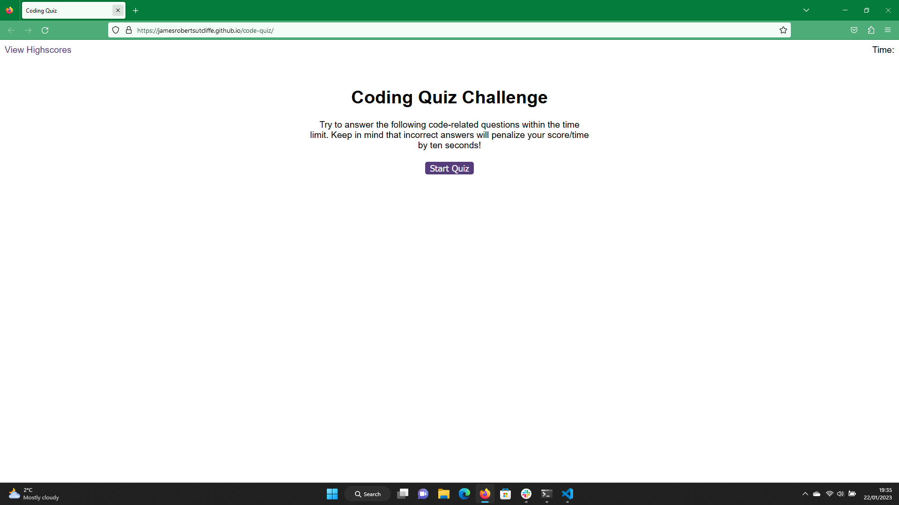

## Code Quiz

## Description

Creating the code quiz developed my javascript skills and knowledge further by creating an application utilising HTML, CSS and Javascript linked together using DOM as well as storing and retrieving with local storage. The project implements event listeners, DOM functions, javascript modules and local storage. The project allows the user to brush up on their coding knowledge in a fun and easy to use application. On completion of the project I have further developed my javascript, html and CSS skills with DOM, as well as developed skills in pushing data to local storage.

## Installation

N/A.

## Usage

Simply click the start button to begin the quiz. Select your desired answer by clicking. Once the quiz is over log you initials and high score to local storage and view this on the high scores page.

## Credits

N/A.

## License

please see license file in main branch of gitHub repository.

## Deployed Site

https://jamesrobertsutcliffe.github.io/code-quiz/